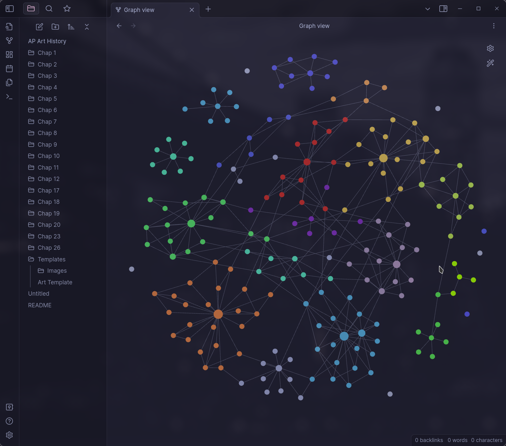

# AP Art History Notes

Welcome to my online AP Art History notes. This repository is exported from `Obsidian.md` around once a week (unless I forget). The notes are a direct compendium from the Barron's AP Art History Textbook, smarthistory, and lecture notes from my class. Currently the notes are until Barron's Chapter 26, but skipping a few chapters in between that I will fill in.

### Most Recent Notes Graph

## How to Use
### On Github (Easiest)
To access my notes, simply click on the folder for the chapter you're interested in. Within each chapter folder, you'll find a set of Obsidian notes that cover the key concepts and artworks from that chapter.

Currently the image links are broken due to the GitHub markdown formatter being different from the Obsidian one. I am working on a Python3 script to auto-fix this.

### With Obsidian (Recommended)
These notes were created in `Obsidian.md`, a free and open-source note-taking app. They are exported in the `.md` file format, making them readable anywhere. However they will appear visually stunning and properly formatted only in the app. Here's how to use it:

1.  Go to the [Obsidian website](https://obsidian.md/) and click on the "Download" button.
2.  Choose the version of Obsidian that's compatible with your operating system (Windows, macOS, or Linux) and download the installer.
3.  Once the download is complete, run the installer and follow the prompts to install Obsidian on your computer.

After you've installed Obsidian, you can load my notes by following these steps:

1.  Download the repository files by clicking on the green "Code" button above and choosing "Download ZIP."
2.  Extract the downloaded ZIP file to a location on your computer.
3.  Open Obsidian and click on the "Open Folder" button in the top left corner.
4.  Navigate to the folder where you extracted the repository files and select the folder for the chapter you want to view.

That's it! You should now be able to view my notes in Obsidian and explore the various links and resources that I've included.

